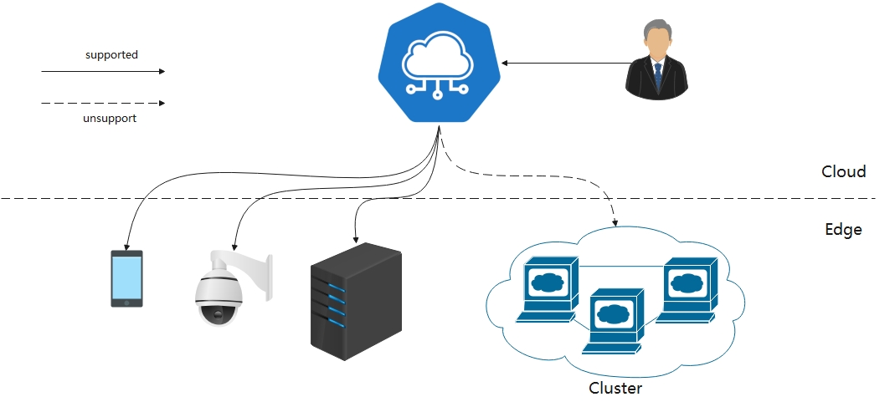

| title        | authors     | approvers                  | creation-date | last-updated | status    |
| ------------ | ----------- | -------------------------- | ------------- | ------------ | --------- |
| Edge Cluster | @WintonChan | @kevin-wangzefeng@fisherxu | 2020-03-17    | 2020-03-17   | Designing |

# Edge cluster

## Abstract

​	Under scenarios of edge computing , there are multiple Kubernetes clusters deployed at the edge. Administrators/users hope to manage edge  clusters on the cloud centrally and take advantages of more cloud-native capability on the edge. 

​    This design doc is to enable customers manage edge clusters on the cloud.

## Motivation

​	Edge nodes refers to the business platform built on the edge of the network close to the user, provide storage, computing, network and other resources. Sink parts of crucial applications to the edge network to reduce the bandwidth and delay caused by network transmission and multi-level forwarding. Edge nodes are not limited to edge devices such as terminal devices, surveillance cameras, and smart small stations, but can also generally refer to edge clusters such as CDN sites and customer private data centers that have basic IaaS capabilities and relatively rich resources. Edge clusters have the advantages of low latency and network security isolation, but they also have problems such as difficulty in operation and maintenance and low resource utilization. Currently, KubeEdge only supports interface edge devices and does not support the management of edge clusters. In order to provide unified management and scheduling, and expand the cloud native capabilities of edge nodes, we plan to implement KubeEdge to support edge cluster management.		

### Goals

- centralized management of edge kubernetes clusters

### Non-goals

- collaboration between edge clusters and edge nodes

## Proposal

### Discussion

1. How to define the logical relationship between edge clusters and edge nodes?

2. How to manage edge clusters on the cloud? In addition to supporting state synchronization, what other capabilities are needed?

3. Does the application on the edge node need to communicate with the application on the edge cluster?

### User story

​    User has multiple kubernetes clusters on the edge, and each cluster is in an isolated network subnet. The user needs to access the subnet through different agents to perform operation and maintenance management of the cluster. Users need to manage all edge clusters on the cloud in order to simplify operation and maintenance management

### Use case

​    User calls the native API interface of the edge K8s cluster on the cloud

1. User needs to deploy the Tunnel Agent application on the edge cluster
2. The user calls the API of the edge cluster through the control plane IP of the edge cluster

## Design Details

To be added

## Implementation plan

- 

